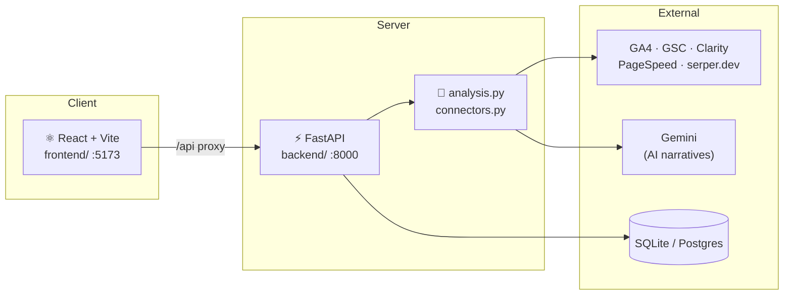

<div align="center">

# 📊 AI Growth Analyst

**One dashboard that turns GA4, Search Console, Clarity & live Google rankings into an AI-written growth plan.**

Built for the [Schbang](https://schbang.com) SEO · CRO · Content teams.

<br>


</div>

---

## ✨ What is this?

An internal analytics platform that runs a **13-module growth report** for any client brand. It pulls the numbers deterministically from the real APIs, then uses AI to explain *why* things moved and *what to do next* — grouped into a task list your team can actually action.

It stitches together five data sources into one report:

| Source | What it gives |
|---|---|
| 📈 **Google Analytics 4** | sessions, engagement, events, funnels |
| 🔍 **Google Search Console** | clicks, impressions, CTR, rankings, indexation |
| 🖱️ **Microsoft Clarity** | scroll depth, dead / rage / quick-back clicks |
| ⚡ **PageSpeed / CrUX** | Core Web Vitals for declining pages |
| 🌐 **serper.dev** | live Google-India SERP positions + competitors |

### The 13 modules

```
📋 Executive Summary      — the one-page verdict + 3-month plan + "since last report" diff
✅ Action Plan            — every finding merged into one prioritized, exportable task list

Performance   →  Organic Performance · User Journey · Path Exploration · Funnel Drop-off
Engagement    →  Heatmap / Click · Scroll Analysis
Keywords      →  Keyword Intelligence · Top Keyword Opportunity · Uplift Tracker · Cannibalization
Health        →  UX & Speed Audit · Hidden Insights · Indexation Health

🔧 Tools       →  On-Page SEO blueprint generator
```

> 💡 **The "forgotten middle."** Most tools only show winners and disasters. **Uplift Tracker** surfaces the stable-but-mediocre pages one small fix away from real gains — CTR-gap pages, flatliners, page-2 keywords, and live SERP tracking of exactly which competitors sit above you.

---

## 🏗️ Architecture



The **React frontend** is the product. The **FastAPI backend** owns auth, per-client credentials, and the report pipeline. Both reuse the same `analysis.py` / `connectors.py` engine that also powers the legacy **Streamlit app** (`app.py`).

```
SEO_TOOL/
├── frontend/            ⚛️  React + TypeScript + Vite dashboard  → the UI
│   └── src/components/  ModuleViews, Dashboard, DateRange, ActionPlan…
├── backend/             ⚡  FastAPI — auth, DB, report jobs      → the API
│   └── app/
│       ├── routers/     auth · clients · reports · onpage · admin
│       ├── services/    reports.py (the 13-module pipeline)
│       └── settings.py  env-based config
├── analysis.py          🧠  all module logic + AI reasoning       (shared)
├── connectors.py        🔌  GA4 / GSC / Clarity / serper clients  (shared)
├── demo_data.py         🎭  sample data — runs with zero keys     (shared)
└── app.py               📟  legacy Streamlit UI (still works)
```

---

## 🚀 Quick start

You need **Python 3.12+** and **Node 18+**.

The app has two halves — run the **backend** and the **frontend** in two terminals. (Or skip the backend entirely and run the frontend in **mock mode** — see below.)

<table>
<tr><th>🐧 Linux / macOS</th><th>🪟 Windows (PowerShell)</th></tr>
<tr valign="top"><td>

**1 · Backend** → http://localhost:8000
```bash
cd backend
python3 -m venv .venv
source .venv/bin/activate
pip install -r requirements.txt
cp .env.example .env          # then edit — see below
uvicorn app.main:app --reload --port 8000
```

**2 · Frontend** → http://localhost:5173
```bash
cd frontend
npm install
echo "VITE_USE_MOCK=false" > .env.local
npm run dev
```

</td><td>

**1 · Backend** → http://localhost:8000
```powershell
cd backend
python -m venv .venv
.venv\Scripts\Activate.ps1
pip install -r requirements.txt
copy .env.example .env         # then edit — see below
uvicorn app.main:app --reload --port 8000
```

**2 · Frontend** → http://localhost:5173
```powershell
cd frontend
npm install
"VITE_USE_MOCK=false" | Out-File -Encoding utf8 .env.local
npm run dev
```

</td></tr>
</table>

Open **http://localhost:5173**. With `DEV_AUTH_BYPASS=true` (below) you're logged straight in — no Google sign-in needed locally.

### ⚡ Zero-setup demo (no backend, no keys)

Just want to click around the UI? Run the frontend in **mock mode** — it serves realistic sample data with no backend at all:

```bash
cd frontend
npm install
echo "VITE_USE_MOCK=true" > .env.local    # 🪟  "VITE_USE_MOCK=true" | Out-File -Encoding utf8 .env.local
npm run dev
```

---

## 🔑 Configuration (`backend/.env`)

Copy `backend/.env.example` → `backend/.env` and fill it in. **For local dev you only need a handful of values** — the rest are for live data and production.

### Minimal local setup (SQLite, no Google login)

```ini
ENVIRONMENT=development
DEV_AUTH_BYPASS=true                    # skip Google OAuth locally
DEV_USER_EMAIL=you@schbang.com

# SQLite = zero setup. (Postgres string also works — see below.)
DATABASE_URL=sqlite:///./growth_analyst_dev.db

# Generate once — see command below 👇
CREDENTIAL_ENCRYPTION_KEY=paste-a-fernet-key-here
SESSION_SECRET=any-long-random-string

# Optional but recommended:
GEMINI_API_KEY=AIzaSy...                # AI narratives (app works without it)
SERPER_API_KEY=...                      # live SERP tracking in Uplift Tracker
SERPER_GL=in                            # SERP country (in = India)
```

Generate the encryption key:

```bash
# 🐧 Linux/macOS  &  🪟 Windows
python -c "from cryptography.fernet import Fernet; print(Fernet.generate_key().decode())"
```

### Full env reference

<details>
<summary><b>Click to expand all variables</b></summary>

| Variable | Required? | What it's for |
|---|---|---|
| `ENVIRONMENT` | ✔ | `development` or `production` (production forces secure cookies) |
| `DEV_AUTH_BYPASS` | dev only | `true` logs you in as `DEV_USER_EMAIL` with no OAuth |
| `DEV_USER_EMAIL` | dev only | identity assumed when bypass is on |
| `DATABASE_URL` | ✔ | `sqlite:///./growth_analyst_dev.db` for local, Postgres for prod |
| `CREDENTIAL_ENCRYPTION_KEY` | ✔ | Fernet key — encrypts client Google creds at rest |
| `SESSION_SECRET` | ✔ | signs session cookies |
| `FRONTEND_ORIGIN` | ✔ | CORS allowlist, e.g. `http://localhost:5173` |
| `AUTH_GOOGLE_CLIENT_ID` / `_SECRET` | prod | Google OAuth login gate |
| `AUTH_ALLOWED_DOMAIN` | prod | restrict login to a domain (e.g. `schbang.com`) |
| `AUTH_REDIRECT_URI` | prod | OAuth callback URL |
| `GEMINI_API_KEY` | optional | AI narratives (tables/charts still render without it) |
| `XAI_API_KEY` | optional | alternate AI engine |
| `GOOGLE_PAGESPEED_API_KEY` | optional | Core Web Vitals in UX & Speed Audit |
| `CLARITY_API_TOKEN` | optional | scroll / dead-click data (Clarity exports last 1–3 days only) |
| `SERPER_API_KEY` | optional | live Google SERP checks in Uplift Tracker |
| `SERPER_GL` | optional | SERP country code, default `in` |

</details>

### Getting the data-source credentials

<details>
<summary><b>Google service account (GA4 + GSC), Gemini, Clarity, serper.dev</b></summary>

- **Google service account** (one account does GA4 **and** GSC):
  1. Google Cloud Console → create a service account → create a **JSON key**.
  2. Enable **Google Analytics Data API** + **Search Console API**.
  3. GA4 → Admin → *Property Access Management* → add the service-account email as **Viewer**.
  4. GSC → Settings → *Users and permissions* → add it (Restricted is fine).
  5. Add the brand + its JSON via the in-app **Admin** panel (encrypted at rest).
- **Gemini** — [Google AI Studio](https://aistudio.google.com/apikey) → API key.
- **Microsoft Clarity** — Clarity dashboard → Settings → **Data Export** → token.
- **serper.dev** — [serper.dev](https://serper.dev) → API key (free credits on signup; ~10 credits per report run, one batched call).

</details>

---

## 🖥️ Legacy Streamlit app (optional)

The original single-file app still runs and works in demo mode with zero keys:

```bash
# 🐧 Linux/macOS
python3 -m venv .venv && source .venv/bin/activate
pip install -r requirements.txt
streamlit run app.py                    # → http://localhost:8501
```
```powershell
# 🪟 Windows
python -m venv .venv; .venv\Scripts\Activate.ps1
pip install -r requirements.txt
streamlit run app.py                    # → http://localhost:8501
```

---

## 🧰 Handy commands

```bash
# Frontend
npm run dev          # dev server (HMR)
npm run build        # production build → dist/
npm run typecheck    # tsc, no emit

# Backend
uvicorn app.main:app --reload --port 8000     # dev, auto-reload
python -m py_compile app/**/*.py              # quick syntax check
```

---

## 🩹 Troubleshooting

<details>
<summary><b><code>git push</code> rejects my correct password</b></summary>

GitHub removed password auth in 2021. Use a **Personal Access Token** (Settings → Developer settings → Tokens → `repo` scope) as the *password* at the prompt, or switch the remote to SSH.
</details>

<details>
<summary><b><code>sqlite3.OperationalError: unable to open database file</code></b></summary>

Your `DATABASE_URL` points somewhere that doesn't exist (e.g. a Windows path on Linux). Use a path valid for your OS, or the relative default `sqlite:///./growth_analyst_dev.db`.
</details>

<details>
<summary><b><code>Cannot find module @rollup/rollup-linux-x64-gnu</code> (frontend on Linux)</b></summary>

A known npm optional-deps bug. Fix with:
```bash
rm -rf node_modules package-lock.json && npm install
# or, quicker:
npm install @rollup/rollup-linux-x64-gnu
```
</details>

<details>
<summary><b>The venv won't activate / has <code>.exe</code> files on Linux</b></summary>

A venv created on Windows (`.venv/Scripts/*.exe`) won't run on Linux and vice-versa. Delete it and recreate: `python3 -m venv .venv`. Linux uses `.venv/bin/`, Windows uses `.venv\Scripts\`.
</details>

<details>
<summary><b>Frontend loads but shows no data / can't reach the API</b></summary>

Make sure the backend is running on **:8000** (Vite proxies `/api` → `localhost:8000`), and that `frontend/.env.local` has `VITE_USE_MOCK=false`. For a backend-free UI, set it to `true`.
</details>

---

## 🚢 Deployment

| Piece | Where | Notes |
|---|---|---|
| **Frontend** | Vercel / Netlify | static build (`npm run build`) |
| **Backend** | Render / Railway | long-running; report jobs take ~60–90s |
| **Database** | Neon / Supabase | managed Postgres for production |

For production set `ENVIRONMENT=production` (secure cookies), move `CREDENTIAL_ENCRYPTION_KEY` + OAuth secrets to a Secret Manager, and manage the schema with Alembic instead of dev auto-create. Docker, `render.yaml`, and `railway.json` are included.

---

<div align="center">
<sub>Built with ⚡ FastAPI, ⚛️ React, and a lot of GSC data · Schbang Analytics</sub>
</div>
